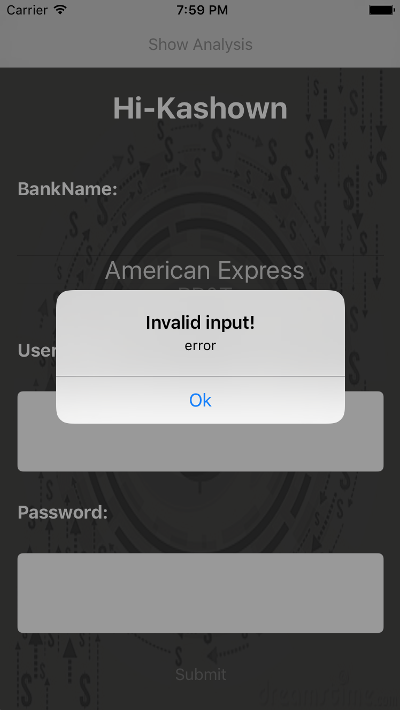
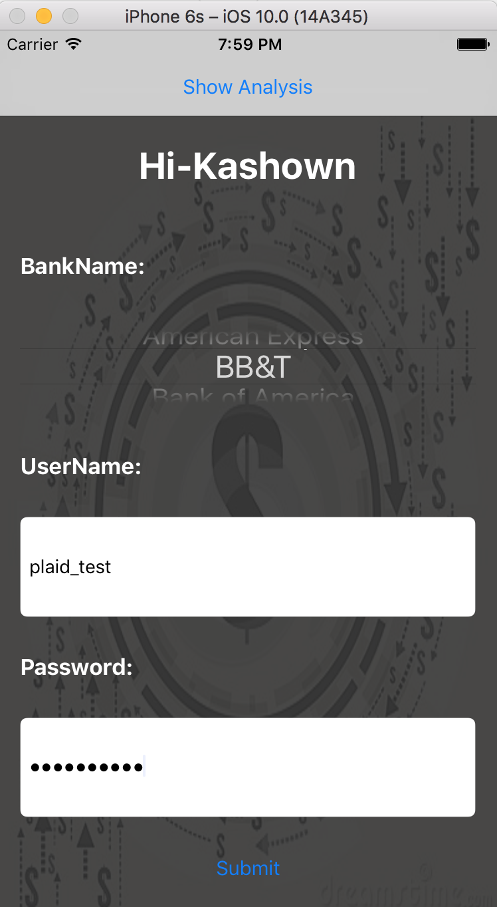
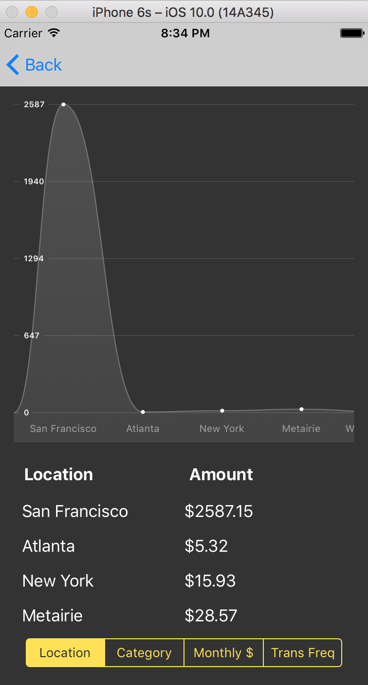
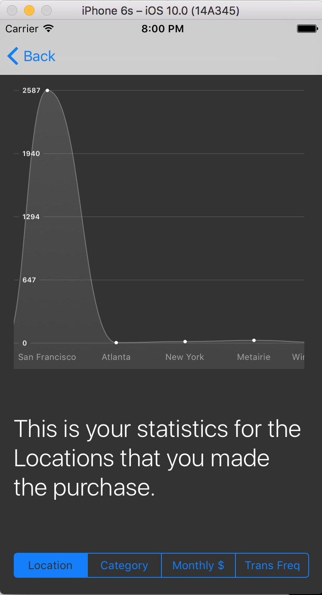

#Directed Research

### Feature included:
- Get user input (bank name, account number and password), and then fetch user's financial transactions by using Plaid API.
- Visualize user's consumption behaviour (location, category, monthly purchase amount and monthly transfer amount)

Data visualization is done by using the third-party library: https://github.com/philackm/Scrollable-GraphView
 
### Following demos are completed by using Plaid test account:
- User input validation 
</img>  </img>  
- Consumption behaviour visualization 
</img>  </img>  
