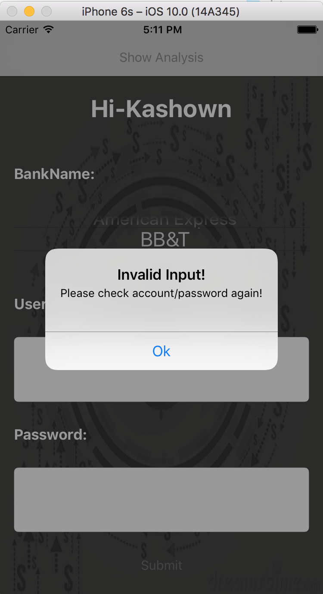
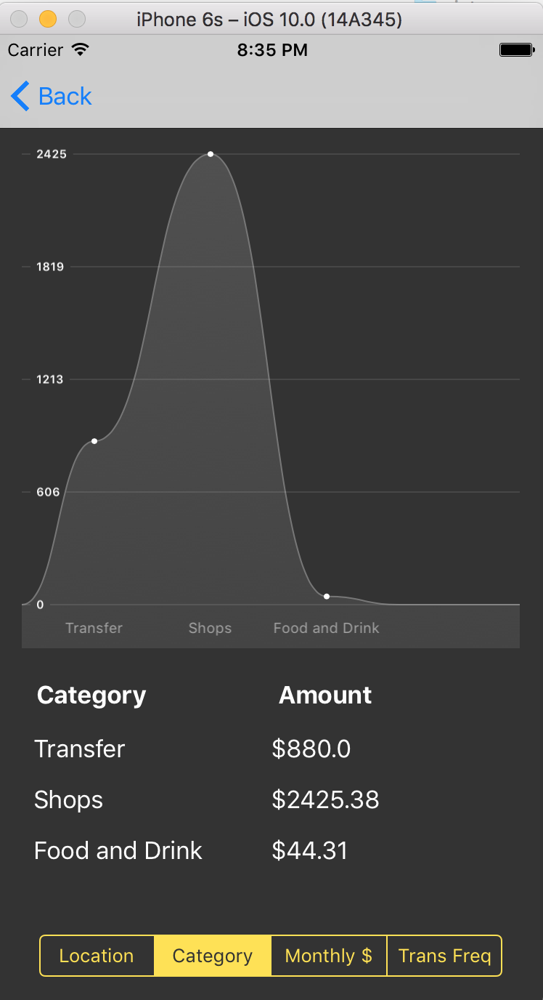

#Directed Research

### Feature included:
- Get user input (bank name, account number and password)
- Visualize user's consumption behaviour (location, category, monthly purchase amount and monthly transfer amount)

</img>  </img>  
</img>  </img>  
